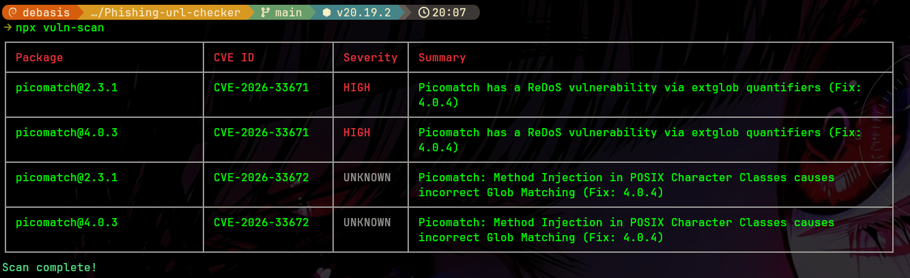

# vuln-scan

A Node.js CLI that scans a project’s **lockfile** (npm / pnpm / yarn) to find known vulnerabilities using the **OSV.dev** API.

## Features

- Detects package manager by lockfile:
	- npm: `package-lock.json`
	- pnpm: `pnpm-lock.yaml`
	- yarn: `yarn.lock`
- Reads **exact installed versions** from the lockfile
- Queries OSV (`https://api.osv.dev/v1/query`) per dependency
- Colored, human-readable table output (chalk + cli-table3)
- Spinner while scanning (ora)
- Optional `--json` output for automation
- Includes fix version when OSV provides one

## Demo



## Install / Run

### Run with npx

```bash
npx vuln-scan
```

### Install globally

```bash
npm i -g vuln-scan
vuln-scan
```

This package also exposes `vuln-scan-cli` as an alias:

```bash
npx vuln-scan -- --json
npx vuln-scan-cli
vuln-scan-cli --json
```

## Usage

```bash
vuln-scan
vuln-scan --json
```

## Notes

- Requires Node.js `>= 18` (uses built-in `fetch`).
- Scans both dependencies and devDependencies as recorded in the lockfile.

## Development

```bash
pnpm install
node ./cli.js
node ./cli.js --json
```


